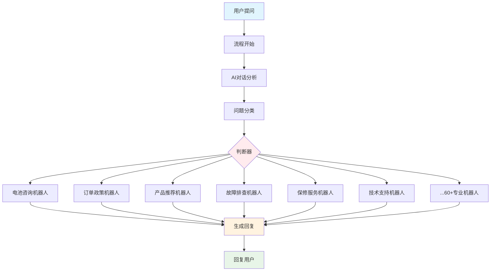

# 大疆客服多轮机器人工作流程图

```mermaid
flowchart TD
    A[👤 用户提问] --> B[🚀 流程开始]
    B --> C{🧠 AI对话分析}
    C --> D[📊 多轮分类抓取top10]
    D --> E{🎯 判断器 - 问题分类}
    
    E -->|电池相关| F1[🔋 咨询电池信息及充电方式]
    E -->|订单相关| F2[📋 咨询订单价保政策]
    E -->|产品丢失| F3[🔍 飞丢全场景处理]
    E -->|购买推荐| F4[🛒 产品购买推荐]
    E -->|序列号| F5[🏷️ 产品SN相关]
    E -->|配件兼容| F6[🔧 产品配件兼容性]
    E -->|大疆智图| F7[🗺️ 大疆智图全场景]
    E -->|开关机| F8[⚡ 产品开关机方法]
    E -->|保修| F9[🛡️ 产品保修期咨询]
    E -->|智能功能| F10[🤖 智能功能全场景]
    E -->|相机参数| F11[📷 相机变焦对焦参数]
    E -->|产品对比| F12[⚖️ 产品对比]
    E -->|内存导出| F13[💾 产品内存及素材导出]
    E -->|激活故障| F14[🔓 产品激活方法及故障排查]
    E -->|保险服务| F15[🏥 DJI Care/随心修/随心换]
    E -->|使用教程| F16[📚 产品使用教程]
    E -->|故障排查| F17[🔧 各类故障排查]
    E -->|账号问题| F18[👤 账号咨询]
    E -->|App相关| F19[📱 App相关问题]
    E -->|订单查询| F20[📦 订单咨询]
    E -->|维修相关| F21[🛠️ 维修相关问题]
    E -->|新手保险| F22[🆕 新手保]
    E -->|图传问题| F23[📡 图传报障]
    E -->|无意图发言| F24[💭 用户无意图发言处理]
    E -->|OP3相关| F25[📱 OP3相关]
    E -->|车载产品| F26[🚗 灵猿车载]
    E -->|指示灯| F27[💡 指示灯含义]
    E -->|续航问题| F28[🔋 续航短]
    E -->|按键操作| F29[🔘 按键相关]
    E -->|飞控故障| F30[🎮 飞控报障]
    E -->|RTK相关| F31[📍 RTK相关]
    E -->|飞行模拟| F32[🎮 飞行模拟/虚拟飞行]
    E -->|航线任务| F33[✈️ 航线任务]
    E -->|扫地机器人| F34[🤖 扫地机器人romo]
    E -->|司空2| F35[🌐 大疆司空2]
    E -->|3C认证| F36[📜 3C认证]
    E -->|其他| F37[❓ 其他专业场景...]
    
    F1 --> G1[💬 指定回复]
    F2 --> G2[💬 指定回复]
    F3 --> G3[💬 指定回复]
    F4 --> G4[💬 指定回复]
    F5 --> G5[💬 指定回复]
    F6 --> G6[💬 指定回复]
    F7 --> G7[💬 指定回复]
    F8 --> G8[💬 指定回复]
    F9 --> G9[💬 指定回复]
    F10 --> G10[💬 指定回复]
    F11 --> G11[💬 指定回复]
    F12 --> G12[💬 指定回复]
    F13 --> G13[💬 指定回复]
    F14 --> G14[💬 指定回复]
    F15 --> G15[💬 指定回复]
    F16 --> G16[💬 指定回复]
    F17 --> G17[💬 指定回复]
    F18 --> G18[💬 指定回复]
    F19 --> G19[💬 指定回复]
    F20 --> G20[💬 指定回复]
    F21 --> G21[💬 指定回复]
    F22 --> G22[💬 指定回复]
    F23 --> G23[💬 指定回复]
    F24 --> G24[💬 指定回复]
    F25 --> G25[💬 指定回复]
    F26 --> G26[💬 指定回复]
    F27 --> G27[💬 指定回复]
    F28 --> G28[💬 指定回复]
    F29 --> G29[💬 指定回复]
    F30 --> G30[💬 指定回复]
    F31 --> G31[💬 指定回复]
    F32 --> G32[💬 指定回复]
    F33 --> G33[💬 指定回复]
    F34 --> G34[💬 指定回复]
    F35 --> G35[💬 指定回复]
    F36 --> G36[💬 指定回复]
    F37 --> G37[💬 指定回复]
    
    G1 --> H[✅ 回复用户]
    G2 --> H
    G3 --> H
    G4 --> H
    G5 --> H
    G6 --> H
    G7 --> H
    G8 --> H
    G9 --> H
    G10 --> H
    G11 --> H
    G12 --> H
    G13 --> H
    G14 --> H
    G15 --> H
    G16 --> H
    G17 --> H
    G18 --> H
    G19 --> H
    G20 --> H
    G21 --> H
    G22 --> H
    G23 --> H
    G24 --> H
    G25 --> H
    G26 --> H
    G27 --> H
    G28 --> H
    G29 --> H
    G30 --> H
    G31 --> H
    G32 --> H
    G33 --> H
    G34 --> H
    G35 --> H
    G36 --> H
    G37 --> H
    
    style A fill:#e1f5fe
    style B fill:#f3e5f5
    style C fill:#fff3e0
    style D fill:#fff3e0
    style E fill:#ffebee
    style H fill:#e8f5e8
```

## 简化版流程图

```mermaid
flowchart TD
    A[用户提问] --> B[流程开始]
    B --> C[AI对话分析]
    C --> D[问题分类]
    D --> E{判断器}
    
    E --> F1[电池咨询机器人]
    E --> F2[订单政策机器人]
    E --> F3[产品推荐机器人]
    E --> F4[故障排查机器人]
    E --> F5[保修服务机器人]
    E --> F6[技术支持机器人]
    E --> F7[...60+专业机器人]
    
    F1 --> G[生成回复]
    F2 --> G
    F3 --> G
    F4 --> G
    F5 --> G
    F6 --> G
    F7 --> G
    
    G --> H[回复用户]
    
    style A fill:#e1f5fe
    style E fill:#ffebee
    style G fill:#fff3e0
    style H fill:#e8f5e8
```
