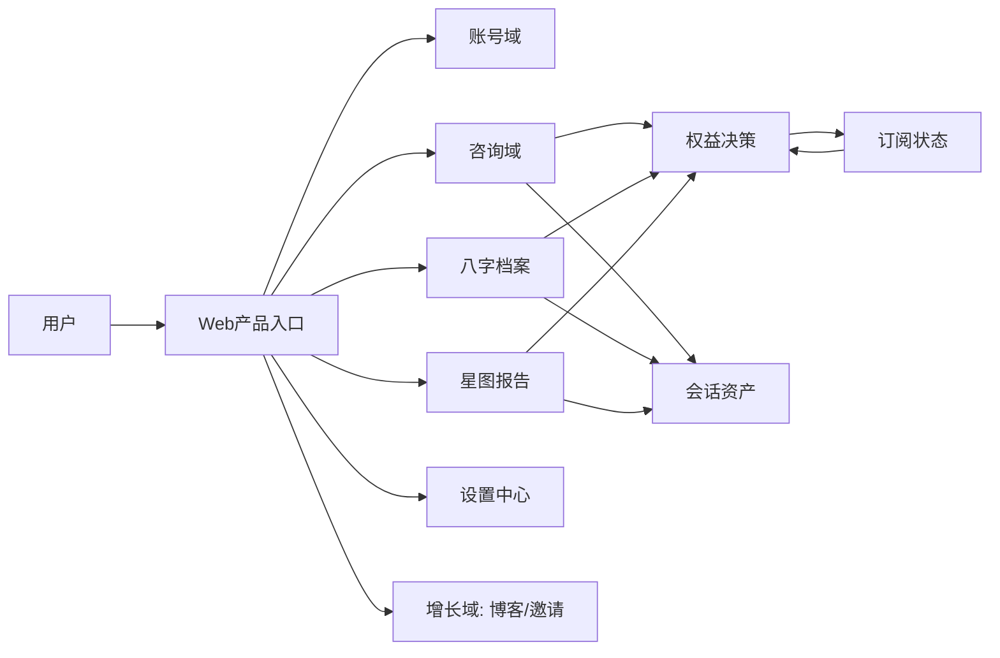
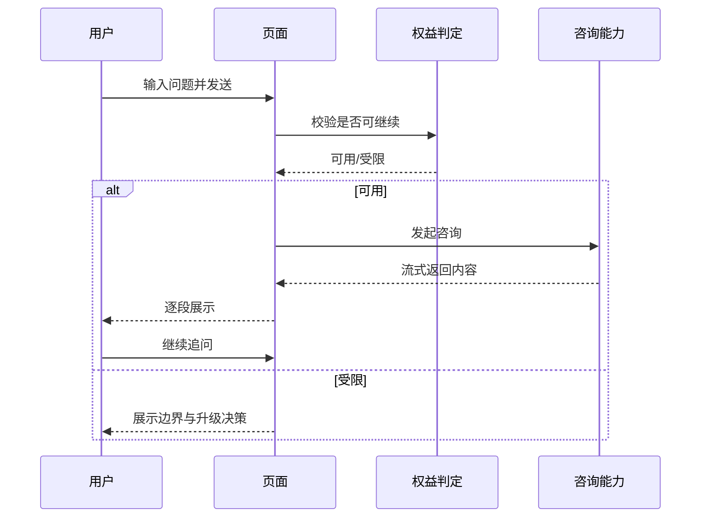
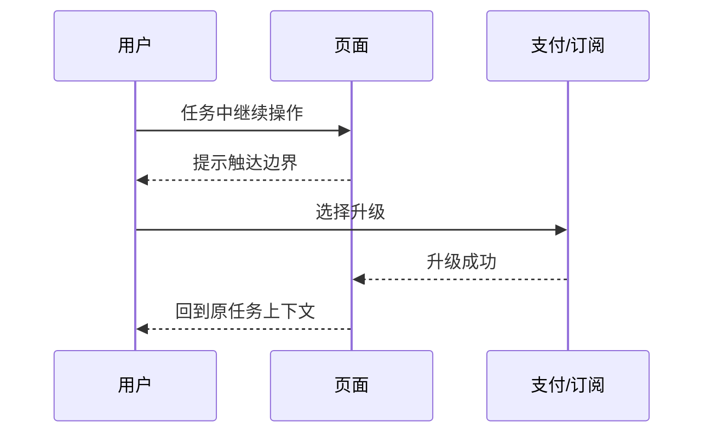

# MetaSight（元见）产品设计PRD（飞书最终版）

> 说明：本版本已融合 `metasight_PRD_reconstructed.md` 与飞书摘要稿，保留单一主文档结构。  
> 目标：可直接用于评审、排期、研发交付。  

---

## 第1章 产品定义与边界

### 1.1 产品定义
MetaSight 是面向 18-35 岁用户的 AI 命理决策辅助产品，帮助用户完成“即时提问 -> 连续追问 -> 结果沉淀 -> 后续复盘”的闭环。

### 1.2 产品要解决的问题
1. 决策时机短：用户需要即时反馈。  
2. 复盘成本高：用户需要历史资产沉淀。  
3. 价值不透明：用户需要可解释的边界与升级路径。  

### 1.3 In Scope
- 账号认证与回跳
- AI 对话咨询（流式、追问建议、输入补全）
- 会话沉淀（线程复访、编辑重发、续接）
- 八字档案管理
- 星图报告生成与章节重试
- 订阅权益与额度边界
- 邀请裂变、博客内容、多语言

### 1.4 Out of Scope
- 人工咨询师实时接入
- 企业多租户组织能力
- 原生 App 首发

### 1.5 产品决策原则
- 先保证可完成，再追求炫技体验
- 先保证可沉淀，再追求一次性惊艳
- 先保证规则清晰，再追求开放边界
- 先保证失败可恢复，再追求零失败

---

## 第2章 目标与背景

### 2.1 业务目标
- 目标A：新用户快速完成首问并感知价值
- 目标B：形成持续追问与复访习惯
- 目标C：触顶用户完成自然升级
- 目标D：深度报告稳定交付

### 2.2 指标体系
| 目标 | 主指标 | 观察周期 | 结果解释 |
|---|---|---|---|
| 激活 | 注册后24h首问率、首问完成率 | 日/周 | 首次价值触达是否成立 |
| 留存 | D1/D7留存、线程复访率 | 周 | 是否形成持续使用 |
| 转化 | 触顶升级率、续费率 | 周/月 | 商业闭环是否健康 |
| 可靠性 | 咨询完成率、恢复成功率、报告完成率 | 日/周 | 异常是否可恢复 |

---

## 第3章 用户角色与任务场景

### 3.1 用户角色
| 角色 | 核心目标 | 关键行为 | 成功定义 |
|---|---|---|---|
| 访客 | 判断价值 | 浏览首页/博客 | 进入注册 |
| 新注册用户 | 完成首问 | 发问并收到可读结果 | 24h内完成首轮 |
| 持续用户 | 复盘沉淀 | 复访线程、维护档案 | 会话深度提升 |
| 触顶用户 | 做升级决策 | 查看边界、比较方案 | 升级后回到原任务 |
| 运营角色 | 拉新促活 | 内容/邀请优化 | 转化效率提升 |

### 3.2 核心场景
- S1 首次咨询
- S2 连续追问
- S3 档案沉淀复用
- S4 星图报告交付
- S5 触顶升级回跳

---

## 第4章 信息架构与产品架构

### 4.1 信息架构（IA）
```text
MetaSight
├─ 公开域：首页 / 法务 / 博客
├─ 账号域：登录 / 注册 / 验证 / 重置
└─ 工作台：对话 / 八字 / 星图 / 设置
```

### 4.2 业务架构图（Mermaid）


### 4.3 权限与导航规则
- 未登录访问受限页面：进入认证，再回原路径
- 已登录用户：公开域与工作台双向可达
- 触顶场景：显示边界说明 + 升级入口 + 稍后处理

### 4.4 导航状态流转
- 未登录访客 -> 登录决策态 -> 已登录任务态
- 任务执行态 -> 边界决策态 -> 升级处理中 -> 原任务继续态

---

## 第5章 核心流程图

### 5.1 首问到多轮咨询（时序图）


### 5.2 星图报告状态流转
```text
未开始 -> 生成中 -> 部分完成 -> 全部完成
生成中 -> 章节失败 -> 单章重试 -> 部分完成/全部完成
```

### 5.3 升级回跳（时序图）


---

## 第6章 功能详细设计（逐模块可拆任务）

> 每个模块统一结构：设计背景 -> 触发条件 -> 主流程 -> 异常兜底 -> 上下游影响 -> 时序/状态

### 6.1 账号注册/登录与身份确认
1. 设计背景：用户需要低门槛进入，并保证身份可验证可找回。  
2. 触发条件：点击注册/登录/验证/重置；访问受限页面。  
3. 主流程：进入认证 -> 提交信息 -> 完成验证 -> 回原任务。  
4. 异常兜底：链接过期可重发；失败可切换方式；回跳失败可手动返回。  
5. 上下游影响：决定首问转化，影响后续资产归属。  
6. 文本时序：访客访问受限页 -> 引导登录 -> 完成验证 -> 返回原页面。  

### 6.2 AI对话咨询（首问到多轮）
1. 设计背景：用户需要即时可读反馈并可连续追问。  
2. 触发条件：发送问题、切换模式、触达边界。  
3. 主流程：发送 -> 生成中 -> 流式展示 -> 追问 -> 沉淀。  
4. 异常兜底：中断可继续，失败可重试，边界可升级或稍后。  
5. 上下游影响：直接影响激活、留存、转化。  
6. 状态流转：待输入 -> 生成中 -> 可阅读 -> 继续追问/完成沉淀。  

### 6.3 会话沉淀、编辑重发与连续性恢复
1. 设计背景：用户会修正问题，需保证上下文一致。  
2. 触发条件：打开历史线程、编辑旧问题、中断后重进。  
3. 主流程：复访线程 -> 编辑重发（如需）-> 生成新后续。  
4. 异常兜底：恢复失败从最后完整节点继续。  
5. 上下游影响：提升复访价值与长期留存。  
6. 文本时序：用户打开线程 -> 编辑历史问题 -> 确认重生成 -> 更新后续内容。  

### 6.4 八字档案管理（个人命理资产）
1. 设计背景：多对象分析需可复用档案。  
2. 触发条件：建档、编辑、置顶、归档、删除、咨询引用。  
3. 主流程：创建档案 -> 校验保存 -> 列表管理 -> 咨询引用。  
4. 异常兜底：字段错误即时提示；触顶提示整理或升级。  
5. 上下游影响：减少重复输入，提高咨询准确度。  
6. 状态流转：未创建 -> 编辑中 -> 可用档案 -> 重点/归档 -> 引用中。  

### 6.5 星图报告生成与章节重试
1. 设计背景：深度结果非即时，用户需要可见进度与可恢复机制。  
2. 触发条件：发起生成、查看进度、重试失败章节。  
3. 主流程：发起 -> 进度展示 -> 章节完成 -> 阅读。  
4. 异常兜底：单章失败可重试，离开后可续看。  
5. 上下游影响：影响高价值交付与续费满意度。  
6. 文本时序：用户发起 -> 返回进度 -> 用户轮询 -> 失败章节重试 -> 完成阅读。  

### 6.6 订阅、权益与额度决策链路
1. 设计背景：用户必须理解受限原因与升级收益。  
2. 触发条件：触达边界、订阅到期、续费完成。  
3. 主流程：边界提示 -> 方案比较 -> 升级 -> 回原任务。  
4. 异常兜底：状态延迟可刷新；取消升级保留上下文。  
5. 上下游影响：决定转化率、投诉率、续费率。  
6. 状态流转：免费可用 -> 接近边界 -> 边界触达 -> 升级处理中 -> 付费可用。  

### 6.7 邀请裂变（推荐与奖励）
1. 设计背景：将口碑行为转化为可追踪增长。  
2. 触发条件：分享邀请码、输入邀请码、达成生效条件。  
3. 主流程：分享 -> 校验 -> 绑定 -> 生效 -> 奖励展示。  
4. 异常兜底：无效码提示、重复领取限制、延迟到账状态。  
5. 上下游影响：降低获客成本，提升新增质量。  
6. 文本时序：邀请人分享 -> 被邀请人提交 -> 校验结果 -> 达成条件 -> 奖励到账。  

### 6.8 博客内容与多语言触达
1. 设计背景：注册前需先建立信任。  
2. 触发条件：访客通过搜索/外链进入内容页。  
3. 主流程：浏览内容 -> 价值认知 -> CTA -> 注册/首问。  
4. 异常兜底：语言回退、内容失效推荐。  
5. 上下游影响：提升自然流量转化。  
6. 状态流转：陌生访客 -> 内容浏览 -> 注册决策 -> 首问准备。  

### 6.9 设置中心（账户/出生信息/订阅/关联账户）
1. 设计背景：统一管理关键资料与权益状态。  
2. 触发条件：用户主动修改信息或核对订阅状态。  
3. 主流程：进入分区 -> 编辑 -> 保存 -> 返回业务页面。  
4. 异常兜底：字段级错误提示，保存失败不丢输入。  
5. 上下游影响：提升信任与结果一致性。  
6. 文本时序：进入设置 -> 提交修改 -> 返回校验 -> 保存成功 -> 返回任务。  

---

## 第7章 界面/交互逻辑

### 7.1 全局状态树
```text
未登录态
 -> 登录决策态
 -> 已登录空闲态
 -> 任务执行态
    -> 正常执行
    -> 边界决策态
    -> 异常可恢复态
    -> 完成沉淀态
```

### 7.2 页面交互规范
- 对话页：线程列表 + 消息流 + 输入区 + 生成状态条 + 边界提示
- 档案页：列表/筛选/编辑弹窗/触顶提示
- 报告页：进度区/章节状态/重试入口/阅读区
- 设置页：分区导航/字段校验/状态回显

### 7.3 跨角色关键时序
- 对话中断后继续
- 边界触达后的升级回跳
- 报告失败章节重试

---

## 第8章 API及关键数据结构

### 8.1 API契约
| 接口 | 输入 | 输出 | 异常返回 |
|---|---|---|---|
| POST /api/chat | messages, threadId, mode, locale | 流式回答 | quota_exceeded / retryable_error |
| POST /api/chat/followup | messages | 建议列表 | 降级为手动输入 |
| POST /api/chat/autocomplete | text | 补全建议 | 忽略并继续输入 |
| GET /api/chat/{id}/stream | thread/stream context | 续接流 | 续接失败可重试 |
| /api/auth/* | 认证参数 | 登录状态 | link_expired / validation_error |
| /api/cron/expire-subscriptions | 定时触发 | 回收结果 | 下一窗口重试 |

### 8.2 关键业务对象
| 对象 | 关键字段 | 用途 |
|---|---|---|
| UserProfile | 身份、基础资料、出生信息 | 个性化与权限基础 |
| ChatThread/Message | threadId、role、content、status | 追问与复访资产 |
| BaziProfile | name、birth、tags、pinned、archived | 多对象命理档案 |
| StarMapReport | reportId、chapterStatus、progress | 深度结果交付 |
| SubscriptionQuota | plan、period、remaining | 边界与升级决策 |
| ReferralRecord | code、binding、rewardStatus | 裂变增长可追踪 |

### 8.3 一致性原则
- 接口失败必须映射到可执行前端动作
- 边界返回必须包含原因与下一步
- 异步任务必须返回可追踪状态

---

## 第9章 限制与假设

### 9.1 限制
- 当前聚焦个人用户，不含组织协同
- 当前聚焦 Web，不含原生端一致交付

### 9.2 假设
- 用户可接受“非即时深度报告”，前提是进度可见
- 用户可接受分层权益，前提是边界可解释
- 用户会在价值感成立后维护个人资料与档案

### 9.3 假设链路时序
用户执行任务 -> 产品返回当前状态 -> 用户决策（继续/升级/重试） -> 产品给可执行下一步 -> 用户完成或稍后续接。

---

## 第10章 风险与待Clarify问题

### 10.1 核心风险
| 风险 | 影响 | 优先级 |
|---|---|---|
| 首问有回复但无价值感 | 激活后快速流失 | P0 |
| 边界触达导致强中断 | 转化下降、投诉上升 | P0 |
| 报告等待焦虑 | 深度功能放弃率高 | P0 |
| 资料不一致 | 信任受损、客服成本上升 | P1 |
| 邀请奖励理解偏差 | 裂变争议 | P1 |
| 多语言不对齐 | 国际化转化受损 | P2 |

### 10.2 待Clarify（评审必须拍板）
1. 边界策略：强引导升级 or 轻提示可跳过  
2. 报告等待阈值与超时提示口径  
3. 邀请奖励生效条件（注册即生效 or 行为达标生效）  
4. 档案删除是否提供恢复窗口  
5. 多语言内容不足时统一回退策略  

---

## 第11章 交付拆解与排期

### 11.1 交付分层
- Epic A：用户进入与首问激活
- Epic B：持续咨询与资产沉淀
- Epic C：深度价值交付
- Epic D：商业化与增长

### 11.2 里程碑
| 里程碑 | 交付范围 | 成功标志 |
|---|---|---|
| M1 可用闭环 | 认证 + 首问 + 会话复访 + 边界提示 | 首问稳定且可恢复 |
| M2 可持续使用 | 档案 + 报告 + 设置一致性 | 深度功能可交付 |
| M3 可规模增长 | 订阅优化 + 邀请 + 内容多语言 | 转化与新增提升 |

### 11.3 上线门禁状态流转
开发中 -> 联调中 -> 待验收 -> 可上线 -> 全量上线 -> 异常回滚/修复。

---

## 第12章 验收标准（UAT）

1. 用户可在单路径完成注册、首问并收到可读反馈。  
2. 中断场景均可恢复，不需要用户重来。  
3. 边界场景可解释、可决策、可回到原任务。  
4. 报告生成可观测，失败章节可重试。  
5. 设置修改后业务页面状态一致。  
6. 邀请与博客链路可追踪转化。  

---

## 第13章 页面预览指引（引用独立文件）

页面结构稿已独立维护在：  
`metasight_page_preview.md`

用于设计与研发的页面骨架联审：
- Landing
- 登录/注册
- 对话工作台
- 八字档案页
- 星图报告页
- 设置中心
