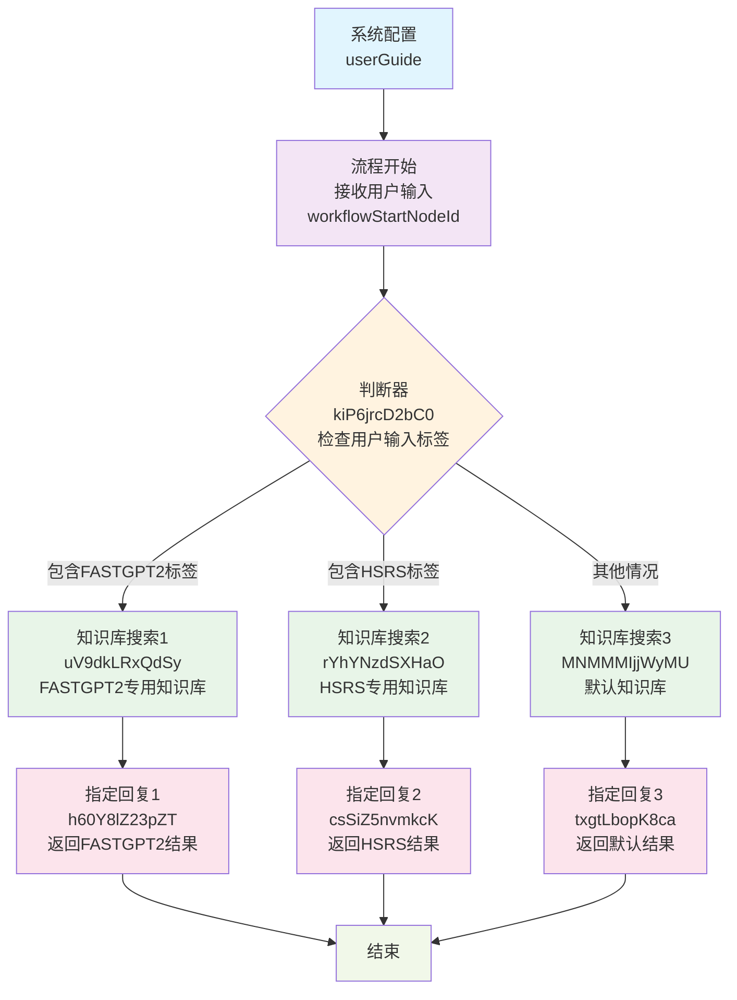

# 兜底单轮FAQ工作流程图

## 流程说明
这是一个基于不同机器人标签的知识库搜索系统，根据用户输入的配置标签，路由到不同的知识库进行搜索并返回结果。

## Mermaid流程图

## 判断条件详解

### 判断器逻辑 (kiP6jrcD2bC0)
- **条件1**: 用户输入以 `<config robot-labels="FASTGPT2"/>` 开头
  - 执行路径: 知识库搜索1 → 指定回复1
  
- **条件2**: 用户输入以 `<config robot-labels="HSRS"/>` 开头  
  - 执行路径: 知识库搜索2 → 指定回复2
  
- **默认情况**: 其他所有输入
  - 执行路径: 知识库搜索3 → 指定回复3

## 节点功能说明

### 系统配置节点
- 配置欢迎文本和系统变量
- 设置TTS和语音识别参数

### 知识库搜索节点配置
- **相似度阈值**: 0.4
- **搜索限制**: 3000字符
- **搜索模式**: embedding（语义搜索）
- **权重设置**: 0.5

### 特殊配置
- HSRS知识库启用了扩展查询功能 (`datasetSearchUsingExtensionQuery: true`)
- 使用GPT-4o-0806模型进行查询扩展
